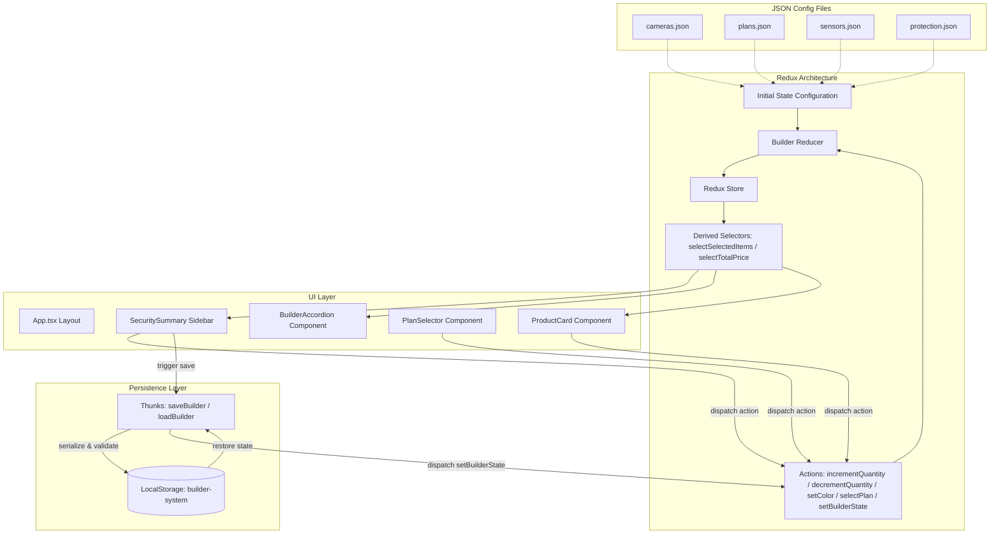

# Wyze Security Bundle Builder

An interactive, enterprise-grade, single-page bundle builder application that enables users to design, customize, and configure their personalized home security systems. Built with React 19, TypeScript, Redux Toolkit, and Tailwind CSS v4.

---

## Overview

The **Wyze Security Bundle Builder** is a responsive web application designed to simplify the complex process of selecting and purchasing home security packages. It provides a cohesive, interactive system builder that guides users through a multi-step configuration wizard.

### Problem Solved
Configuring security setups is often error-prone due to multiple hardware dependencies, color variations, required base stations (e.g., Hubs), and recurring software subscriptions (e.g., Cam Plus plans). This application addresses these challenges by:
- **Enforcing Business Logic Rules**: Restricting plan choices and dynamically integrating mandatory hardware dependencies (e.g., listing the required Wyze Sense Hub as an included free accessory).
- **Managing Granular State**: Keeping color-specific inventory counts separate, preventing accidental overwriting when switching colors.
- **Providing Real-Time Financial Visibility**: Showing users their original price, discounted price, and total savings instantaneously at every stage of their design.
- **Ensuring Continuity**: Allowing users to save their configured build to their browser storage and seamlessly restoring it on future visits.

### User Experience (UX)
The interface is structured as a two-column grid. The left column contains a step-by-step accordion containing product catalogs, color swatches, and quantity selectors. The right column is a sticky review sidebar showing an itemized list of selections, a financing badge, a satisfaction guarantee, and totals. The flow is enhanced by smooth transitions, active borders, and non-intrusive notification toasts.

---

## Live Workflow

The application implements a structured, step-by-step user journey:

```
[Start] ──> Step 1: Choose Cameras ──> Step 3: Choose Sensors ──> Step 2: Choose Plan ──> Step 4: Add Protection ──> [Review & Save]
```

1. **Initialization**: The user lands on the application. The system automatically reads `localStorage` to check for saved setups. If a valid configuration is found, the state is restored; otherwise, the default configurations from static files are loaded.
2. **Step 1 Accordion (Cameras)**: The "Choose your cameras" accordion pane is open by default. The user selects a camera, selects their color choice (White, Grey, or Black), and adjusts the quantity. If they select a color variant (e.g., White) and increase the quantity, they can switch to another variant (e.g., Grey) to add it independently.
3. **Step Navigation (Cameras to Sensors)**: The user clicks the button **"Next: Choose your sensors"** at the bottom of Step 1. The accordion automatically collapses Step 1, opens Step 3 ("Choose your sensors"), and smooth-scrolls the viewport to align the new step header at the top.
4. **Step 3 Accordion (Sensors)**: The user configures sensors. The "Wyze Sense Hub (Required)" is automatically listed and marked as "Included FREE" (isFree: true) if selected, ensuring the user has the required hub.
5. **Step Navigation (Sensors to Plan)**: The user clicks **"Next: Choose your plan"**. The accordion collapses Step 3 and opens Step 2 ("Choose your plan").
6. **Step 2 Accordion (Plan)**: The user selects a subscription model (e.g., "Cam Unlimited" or "Cam Plus"). Clicking a plan changes the active selection radio indicator. The system ensures only one subscription plan is selected at a time with a fixed quantity of 1.
7. **Step Navigation (Plan to Protection)**: The user clicks **"Next: Add extra protection"**. The accordion collapses Step 2 and opens Step 4 ("Add extra protection").
8. **Step 4 Accordion (Protection/Accessories)**: The user adds SD cards or shipping preferences. The "Fast Shipping" item is pre-configured with a "FREE" badge.
9. **Live Review Panel updates**: Throughout the entire journey, the floating **Security Summary** panel displays the itemized list, grouped by category. Different color variants of the same camera (e.g., "Wyze Cam v4 (White)" and "Wyze Cam v4 (Grey)") are displayed as separate line items.
10. **Quantity Synced Adjustments**: The user can adjust quantities directly in the review panel. Changes immediately sync back to the main product cards.
11. **Save Configuration**: The user clicks **"Save my system for later"** inside the review panel. A success toast notifies them that their configuration is saved.
12. **State Restoration**: If the user refreshes or returns later, their full configuration (including specific variant quantities and plan choices) is restored.
13. **Checkout**: The user clicks **"Checkout"** to trigger the final action.

---

## Features

The application incorporates a rich suite of micro-interactions and functional features:

*   **✔ Multi-step Accordion**: Built using customized `@/components/ui/accordion` primitives, featuring custom SVG icons, step markers, and animated headers.
*   **✔ Product Builder**: Dynamic rendering of products sourced directly from decoupled configuration data.
*   **✔ Dynamic Product Cards**: Adaptive card components that adjust their height, active borders, and action controls depending on selection status.
*   **✔ Discount Badges**: Color-coded badges (e.g., violet for "Save 22%" / "Popular", emerald for "FREE" / "Included FREE") rendered dynamically from metadata.
*   **✔ Learn More Links**: Inline links built into descriptions that allow users to inspect specs without disrupting their progress.
*   **✔ Variant Selector**: Horizontal, clickable color swatches showing actual thumbnail previews and text labels.
*   **✔ Independent Quantity Per Variant**: Users can buy separate amounts of different colors of the same camera model.
*   **✔ Quantity Stepper**: Custom plus/minus buttons with responsive disable thresholds and custom SVG icons.
*   **✔ Quantity Synchronization**: Complete state synchronization between product cards and the review panel.
*   **✔ Live Review Panel**: Grouped review sidebar that itemizes selections, billing schedules, and details.
*   **✔ Dynamic Totals**: Real-time evaluation of total pricing including hardware bundles and recurring monthly charges.
*   **✔ Savings Calculation**: Visual celebration banner displaying total money saved (e.g., "Congrats! You're saving $X.XX!").
*   **✔ Shipping Section**: Shipping calculations displayed directly inside the accessories category (e.g., Fast Shipping marked as FREE).
*   **✔ Financing Information**: Renders financing promotions ("As low as...") dynamically using native asset styling.
*   **✔ Satisfaction Guarantee**: Seamless inclusion of a 30-day refund badge to reassure the buyer.
*   **✔ Responsive Layout**: Two-column layout on large viewports which refactors into a linear stack on mobile.
*   **✔ JSON Driven UI**: Declarative JSON schemas govern the product list, prices, options, and defaults.
*   **✔ Reusable Components**: Decoupled UI components including custom steppers, swatches, and badges.
*   **✔ Redux State**: Predictable state container that manages builder configurations and selected items.
*   **✔ Save My System For Later**: Persistent workflow trigger bound to a dedicated action dispatch.
*   **✔ LocalStorage**: Integration with browser storage for client-side state preservation.
*   **✔ Restore Saved Builder**: Auto-restoration on system boot, parsing stored keys and pre-filling the state.
*   **✔ Toast Notifications**: Rich interactive toast messages powered by `sonner` to provide feedback.
*   **✔ Checkout Placeholder**: Interactive call-to-action button styled with high-fidelity brand accents.
*   **✔ Dynamic "N Selected" Badges**: Triggers inside the accordion headers list current selections for that section.
*   **✔ Product Highlight States**: Selected products gain custom visual indicators including a tinted violet border.
*   **✔ Variant Highlight States**: Selected variants render with a custom teal border (`#0AA288`) and tint.
*   **✔ Review Grouping**: Selected products are sorted and separated under matching headers inside the summary.
*   **✔ Automatic Price Updates**: Real-time, zero-lag price calculations executed through Redux selectors.
*   **✔ Automatic Summary Updates**: Instant item updates in the review list when items are added or removed.

---

## Variant System

The camera variant structure is designed to support independent quantities per color variant. Instead of maintaining a single quantity counter for a camera product, the Redux store stores quantities separately inside a color dictionary.

### Redux State Structure
The `cameras` slice state is typed and stored in the following shape:

```typescript
export interface CameraStateItem {
  variantQuantities: Record<string, number>; // Key is lowercase color name (e.g., "white", "grey", "black")
  selectedColor?: string;                    // The active color variant highlighted on the product card
}
```

*   **Sentinel Key**: For cameras without color variants (such as the *Wyze Duo Cam Doorbell*), the system uses `"__default__"` as the sentinel variant key.
*   **Color Swapping**: When a user clicks a color swatch, the `setColor` action is dispatched, updating `selectedColor`. This switches the active card display and updates the quantity stepper to point to `variantQuantities[selectedColor]`.
*   **Independent Quantities**: Modifying the quantity increments/decrements *only* the active color's slot. For example, if a user selects `White` and increments to `2`, then selects `Grey` and increments to `1`, the Redux state holds:
    ```json
    "wyze-cam-v3": {
      "variantQuantities": {
        "white": 2,
        "grey": 1,
        "black": 0
      },
      "selectedColor": "Grey"
    }
    ```
*   **Review Panel Expansion**: The selector `selectSelectedItems` flattens the nested dictionary into separate review rows. It checks each color variant for quantities greater than zero and generates a composite item ID (e.g., `wyze-cam-v3__white` and `wyze-cam-v3__grey`). This forces React to render them as separate, independent rows in the summary sidebar with their own labels and quantity controls.

---

## Save System

The application features local state persistence. This enables users to save their progress and resume configuring their security setup at a later time.

```
[User Clicks Save] ──> Read State ──> Serialize to JSON ──> Save to LocalStorage ──> Trigger Success Toast
                                                                                     
[App Initial Boot] ──> Read LocalStorage ──> Check JSON Schema ──> Valid? ──> Dispatch setBuilderState
```

### Save Flow
1. When the user clicks the "Save my system for later" button, it dispatches the `saveBuilder()` thunk.
2. The thunk reads the entire `builder` state slice using `getState().builder`.
3. The state is serialized to a JSON string and saved under the storage key `"builder-system"`.
4. A success toast is triggered using `toast.success` from `sonner`, providing immediate visual feedback:
   *   **Title**: "Saved successfully"
   *   **Description**: "Your security system has been saved. You can come back later and continue where you left off."

### Restoration & Validation Flow
1. When the application initializes in `src/main.tsx`, the store dispatches the `loadBuilder()` thunk *before* rendering the root React element.
2. The thunk reads `"builder-system"` from `localStorage`.
3. If data is found, it is parsed and validated using `isValidBuilderState(parsed)`.
4. **Type-Safe Validation**: The validation checks:
   *   Presence of `cameras`, `plans`, `sensors`, and `protection` objects.
   *   Structure of camera variants (that `variantQuantities` is a Record of string-to-number).
   *   Structure of plans, sensors, and protection records.
5. If validation passes, the `setBuilderState` action is dispatched, updating the Redux store. If validation fails (e.g., due to schema corruption or stale properties), the load is aborted, leaving the application in its clean default state.

---

## Pricing Logic

The pricing engine is implemented through selectors, ensuring calculations are computed in one place and remain synchronized across all views.

*   **Original Price**: The base manufacturer's suggested retail price (MSRP) for the item.
*   **Discounted Price**: The actual sales price of the item.
*   **Savings**: The difference between the original price total and the discounted price total:
    $$\text{Savings} = \sum (\text{Original Price} \times \text{Qty}) - \sum (\text{Discounted Price} \times \text{Qty})$$
*   **Free Items**: Certain items are flagged with `isFree: true` in the configuration files (e.g., *Wyze Sense Hub* and *Fast Shipping*). The calculation engine handles free items by resolving their discounted unit price to `0.00` regardless of the static values, and the UI displays a green `FREE` text.
*   **Plan Pricing & Recurring Costs**: Subscription plans (like *Cam Unlimited*) feature a `billingCycle: "monthly"` property. The pricing selector adds these items to the totals and appends a `/mo` suffix in the review list to distinguish recurring monthly plans from one-time hardware purchases.

---

## State Management

The application utilizes **Redux Toolkit** for structured state management. The state slice is isolated to `src/store/builderSlice.ts`.

### Redux Architecture

```
                 ┌────────────────────────────────┐
                 │          Redux Store           │
                 │   (Single Source of Truth)     │
                 └───────┬────────────────┬───────┘
                         │                ▲
               useSelector()        useDispatch()
                         │                │
                         ▼                │
                 ┌──────────────┐         │
                 │ UI Components│─────────┘
                 └──────────────┘
```

*   **Actions**:
    *   `incrementQuantity`: Dispatched when raising quantities. Handles camera variants separately by referencing the selected color, and general quantities for sensors or protection.
    *   `decrementQuantity`: Dispatched when lowering quantities. Safeguards values to ensure they do not fall below zero.
    *   `setColor`: Dispatched when swapping active color variants.
    *   `selectPlan`: Dispatched when choosing a subscription plan.
    *   `setBuilderState`: Dispatched by the load thunk to load a saved setup.
*   **Reducers**: A single slice reducer manages updates to `cameras`, `plans`, `sensors`, and `protection` states using Immer (built into Redux Toolkit) for immutable updates.
*   **Selectors**:
    *   `selectSelectedItems`: Filters the builder state and returns a list of items with quantities greater than zero. Expands camera variant records into distinct rows, resolving their names, images, colors, and prices.
    *   `selectTotalPrice`: Computes the financial aggregates (`originalTotal`, `discountedTotal`, `savings`).

---

## Data Flow

Data flows in a unidirectional loop, moving from static configuration to state management, UI components, and browser storage:



---

## Folder Structure

The project follows a standard, modular directory structure for frontend applications:

```text
task-statet-mangegment/
├── public/                 # Static public assets
├── src/                    # Source code
│   ├── assets/             # Media and asset files
│   │   └── images/         # Product images, thumbnails, and trust seals
│   ├── components/         # React components
│   │   ├── builder/        # Custom bundle builder components
│   │   │   ├── BuilderAccordion.tsx  # Multi-step wizard layout
│   │   │   ├── PlanSelector.tsx      # Subscription plan selection cards
│   │   │   ├── ProductCard.tsx       # Standard product item card
│   │   │   ├── QuantityStepper.tsx   # Quantity stepper buttons
│   │   │   ├── SecuritySummary.tsx   # Itemized review sidebar
│   │   │   └── VariantSelector.tsx   # Color variant selection bar
│   │   └── ui/             # Reusable UI primitives (custom shadcn components)
│   │       ├── accordion.tsx
│   │       ├── button.tsx
│   │       └── card.tsx
│   ├── data/               # Configuration data sources
│   │   ├── cameras.json    # Camera product specifications
│   │   ├── plans.json      # Subscription plan options
│   │   ├── sensors.json    # Sensor accessory options
│   │   └── protection.json # Warranty/protection options
│   ├── lib/                # Shared helper libraries
│   │   └── utils.ts        # Tailwind merge utility helper
│   ├── store/              # Redux store configuration and slices
│   │   ├── builderSlice.ts # Actions, reducer, and selectors
│   │   ├── builderThunks.ts# Persistence thunks and validation helpers
│   │   ├── hooks.ts        # Typed Redux hooks wrapper
│   │   └── store.ts        # Store configuration
│   ├── App.css             # Tailwind v4 imports and theme variables
│   ├── App.tsx             # Root layout organizer
│   ├── index.css           # Global CSS variables
│   └── main.tsx            # App bootstrapping and DOM mounting
├── components.json         # Shadcn configurations
├── package.json            # Node project configuration and dependencies
├── tsconfig.json           # TypeScript configuration root
├── tsconfig.app.json       # App-specific TS compiler rules
└── vite.config.ts          # Vite bundle configuration and plugins
```

---

## Components

The application is composed of modular, single-responsibility components:

### Builder Components (`src/components/builder/`)
*   **`BuilderAccordion`**: The step-by-step accordion navigation container. Coordinates active steps and displays current selection counts on triggers.
*   **`PlanSelector`**: Renders subscription card elements with a radio indicator. Modifies the active selected plan ID.
*   **`ProductCard`**: Individual product display card. Handles layout variations, badge colors, descriptions, and mounts the variant selector and quantity stepper.
*   **`VariantSelector`**: Displays color swatch button options with thumbnail icons and names. Highlights the active color using a custom teal border.
*   **`QuantityStepper`**: Component containing plus and minus buttons for count adjustments.
*   **`SecuritySummary`**: Renders the complete, grouped selection summary. Provides inline quantity steppers, savings callouts, financing info, guarantee seals, and save controls.

### UI Primitives (`src/components/ui/`)
*   **`Accordion` / `AccordionItem` / `AccordionTrigger` / `AccordionContent`**: Accessible, animation-wrapped accordion wrappers.
*   **`Button`**: Custom button configurations using `class-variance-authority` (CVA).
*   **`Card`**: Styled structural containers for layout consistency.

---

## Technologies

The application is built on a modern, high-performance web development stack:

| Technology | Purpose | Justification |
| :--- | :--- | :--- |
| **React 19** | View Rendering | Implements the user interface using a virtual DOM for efficient updates. |
| **TypeScript** | Static Typing | Provides compile-time safety, interfaces, and auto-completion. |
| **Redux Toolkit** | State Management | Centralizes builder state and provides selectors to compute pricing dynamically. |
| **Tailwind CSS v4** | Style Management | Utilizes utility-first styling with native CSS variables and theme configurations. |
| **Sonner** | Notification Toasts | Displays non-intrusive notification overlays when saving configurations. |
| **Lucide React** | Icon Library | Provides SVG icon sets for buttons and headers. |
| **Oxlint** | Code Linting | Performs static code analysis with fast check executions. |
| **Vite 8** | Build Tooling | Delivers hot module replacement (HMR) and fast build processes. |

---

## Project Architecture

The application's architecture is guided by the following key principles:

*   **Data-Driven Design**: UI content is modeled declaratively in static JSON files. The interface automatically adapts its layout and pricing based on the JSON configuration.
*   **Centralized State (Redux)**: All selections are stored in a single Redux store. This avoids prop-drilling and ensures child components update in sync.
*   **Derived State Calculations**: Totals and selected item collections are computed dynamically using selectors. This guarantees that UI elements are always in sync.
*   **Component Composition**: Layout-oriented components are decoupled from logic-focused controls. For example, `ProductCard` acts as a container composing the `VariantSelector` and `QuantityStepper`.
*   **Client-Side Persistence**: The builder integrates storage serialization with type validation, safeguarding against structure mismatches or corrupted local storage keys.

---

## Installation

Follow these steps to set up and run the project locally:

```bash
# 1. Clone the repository
git clone <repository-url>
cd task-statet-mangegment

# 2. Install dependencies
npm install

# 3. Start the local development server
npm run dev

# 4. Build the application for production
npm run build

# 5. Preview the production build locally
npm run preview
```

---

## Usage

Follow these steps to configure and save a security system setup:

1.  **Configure Cameras**: Open the "Choose your cameras" accordion. Pick a camera, select a color swatch, and use the stepper to add it. You can select another color for the same camera and add a different quantity; both are added to your summary.
2.  **Add Sensors**: Click "Next: Choose your sensors" (or click the accordion trigger directly). Adjust quantities for motion sensors. The required hub will show as included.
3.  **Select a Plan**: Click "Next: Choose your plan". Choose between the available cloud subscription plans. Only one plan can be selected.
4.  **Add Protection**: Click "Next: Add extra protection". Choose shipping options or add local MicroSD storage cards.
5.  **Review System Totals**: Check the "Your security system" sidebar. The system shows itemized groups, pricing breakdowns, discounts, and recurring monthly costs.
6.  **Save for Later**: Click "Save my system for later" inside the summary panel. A success toast will confirm the build is saved.
7.  **Reload & Restore**: Refresh your browser. The application will restore your full setup automatically.

---

## Design Decisions

*   **Redux Toolkit over Context API**: Using Redux Toolkit helps organize the independent camera variant quantity states and provides a structured place for save/load thunks.
*   **Tailwind CSS v4 Configuration**: Using Tailwind CSS v4's native CSS variables inside `App.css` provides clear style rules without needing a separate configuration file.
*   **JSON-First Configuration**: Declaring product data in JSON files separates design from code, making it easy to add or update items.
*   **Step Order Flow**: The custom button navigation flow (Step 1 -> Step 3 -> Step 2 -> Step 4) aligns with the specific ordering requested by the product team.

---

## Trade-offs

*   **Client-Side Calculations**: Totals are calculated directly on the client. In a production store, pricing would be verified server-side on checkout.
*   **Local Storage Persistence**: The save system uses local storage. While simple and reliable, users cannot access saved configurations across different devices.
*   **Static Asset Imports**: Product images are resolved via a helper mapper in the component. While keeping imports explicit, adding new products requires updating this helper.
*   *All required features from the take-home assignment have been implemented.*

---

## Performance

The application implements the following optimizations:

*   **Memoized Selector Evaluation**: Selectors only recompute totals when their specific dependencies change, avoiding unnecessary calculations.
*   **CSS Filter for Black Variants**: The black variant of the battery-powered camera is generated using a CSS filter on the white variant image. This reduces asset size by avoiding the need to load an additional image file.
*   **Oxlint Static Linter**: Lint checks help catch redundant variables or suboptimal logic before code compilation.
*   **Vite Asset Chunking**: The production build splits code and style assets to optimize initial page load times.

---

## Future Improvements

*   **Database Syncing**: Connect the save system to a user profile database to allow access across devices.
*   **Configuration Sharing**: Add a "Share Build" button that generates a custom URL with the state encoded in a query parameter.
*   **Dynamic Inventory Check**: Add an API layer to check stock status and disable selections when items are out of stock.
*   **Automated Testing Suite**: Implement unit tests for selectors and integration tests for Redux thunks.

---

## Screenshots

Below are placeholders for the interface layout:

```text
┌─────────────────────────────────────────────────────────────┐
│                       HEADER BAR                            │
├──────────────────────────────────────┬──────────────────────┤
│  STEP ACCORDIONS                     │  SECURITY SUMMARY    │
│                                      │                      │
│  [Step 1: Choose your cameras]       │  Your security system│
│  + Wyze Cam v4 (White/Grey/Black)     │  ──────────────────  │
│                                      │  Cameras:            │
│  [Step 2: Choose your plan]          │  - Cam v4 (White) x2 │
│  o Cam Unlimited  o Cam Plus         │  - Cam v4 (Grey)  x1 │
│                                      │  Sensors:            │
│  [Step 3: Choose your sensors]       │  - Motion Sensor  x2 │
│  + Wyze Sense Hub (Included Free)    │  ──────────────────  │
│                                      │  Original:  $158.91  │
│  [Step 4: Add extra protection]      │  Discounted:$127.91  │
│  + Wyze MicroSD 256GB                │  Savings:    $31.00  │
│                                      │  [   Checkout   ]    │
│                                      │  [Save my system]    │
└──────────────────────────────────────┴──────────────────────┘
```


## License

This project is licensed under the MIT License.
